# Portrait Visual Director

把一句人像需求或几张参考图扩写成一张可拍、可生成、可验收的成人肖像：你可以只拿提示词，也可以直接出图。当前版本包含 15 种主风格、45 个正向场景案例和 5 个气质叠加层。

> **仅支持 OpenAI Codex。** 本 Skill 依赖 Codex 内置图片生成、会话图片引用和本地参考图路径能力，不支持 Claude、Cursor、Qoder、Trae 或 GitHub Copilot。

## 生成示例

以下图片均由本 Skill 的实际回归测试生成，未进行人工合成。十五个内置风格各有一张验收通过的示例；最后另附一张多参考图工作流示例。

| 自然生活 | 新中式 / 现代东方 |
|---|---|
| 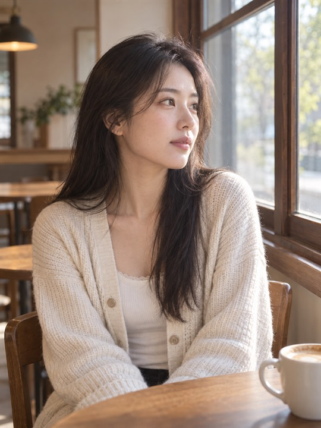 | 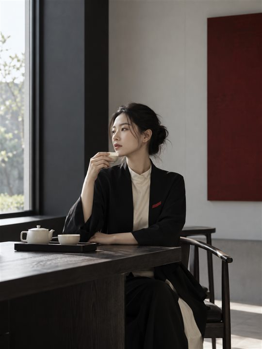 |

| 电影夜景 | 时装编辑 |
|---|---|
| 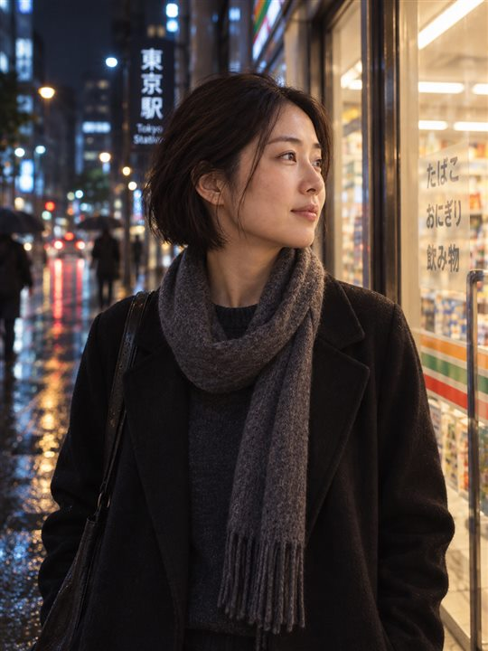 | 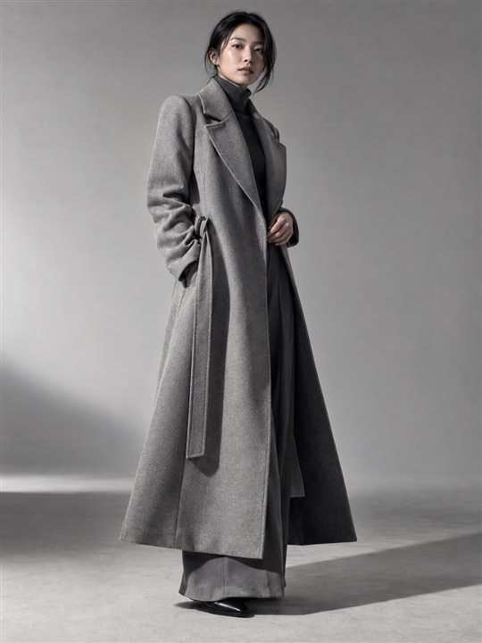 |

| 专业棚拍 | 城市环境 |
|---|---|
| 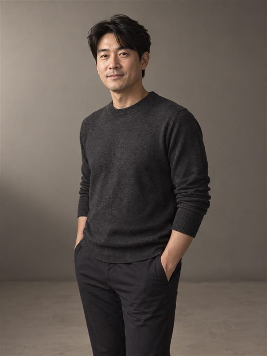 | 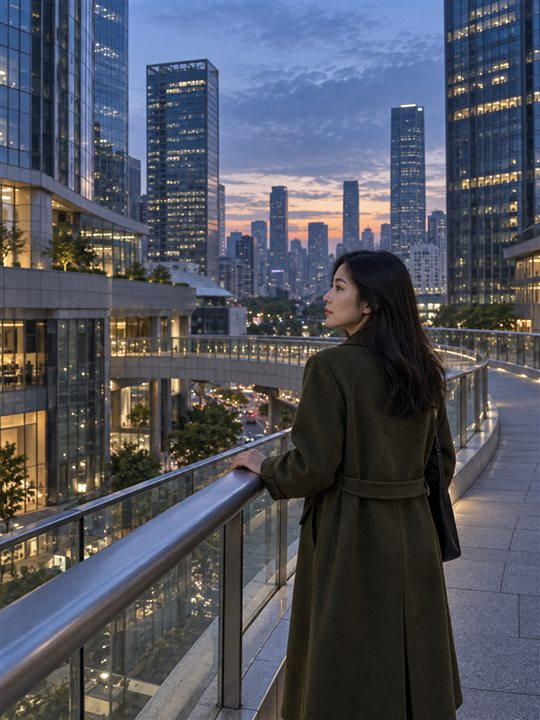 |

| 模拟胶片 | 暗调艺术 |
|---|---|
| 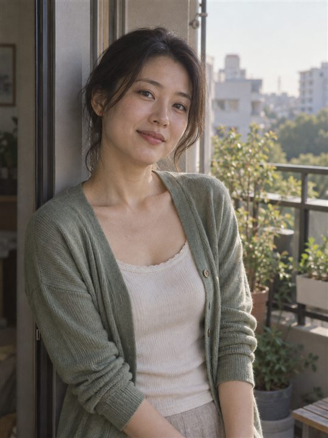 | 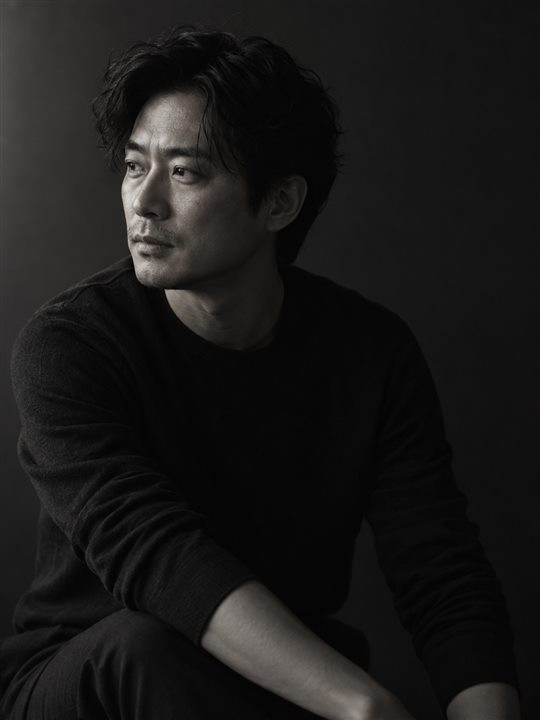 |

| 高调极简 | 职业肖像 |
|---|---|
| 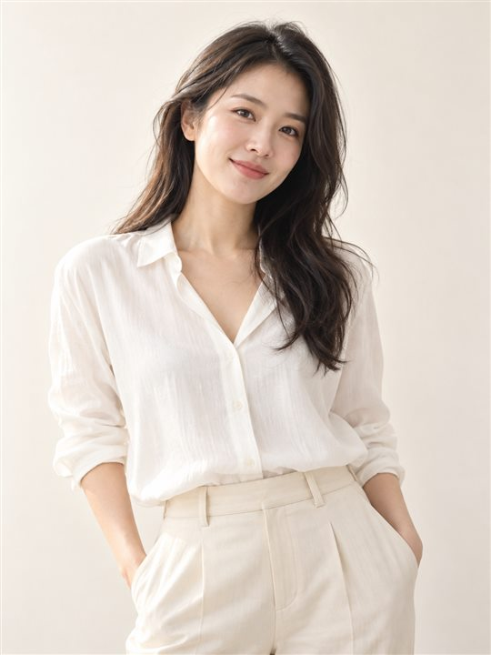 | 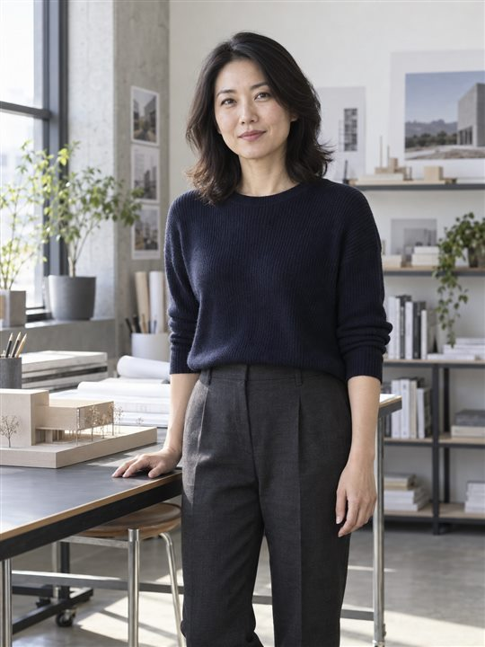 |

| 一句话古风女主 | 历史向汉服 |
|---|---|
| 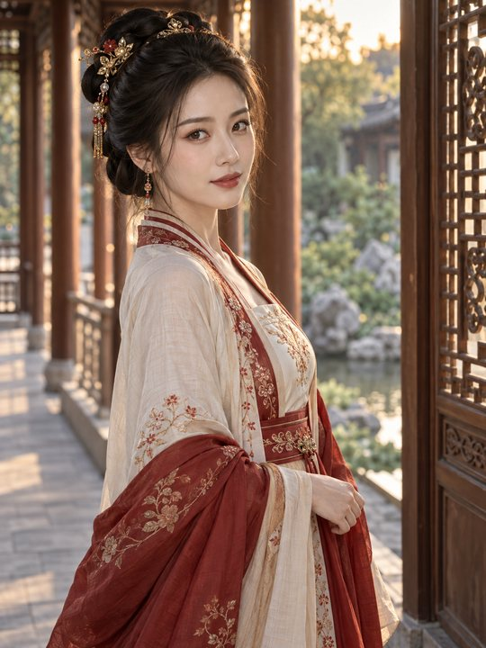 | 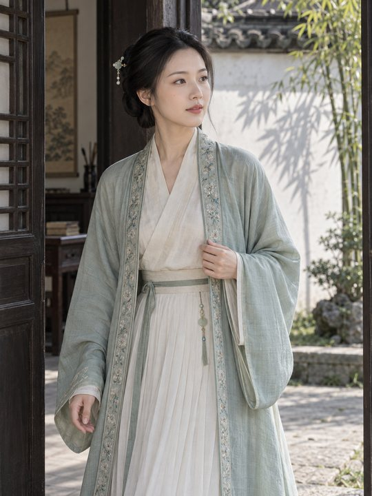 |

| 清冷仙侠 | 明艳华贵古风 |
|---|---|
| 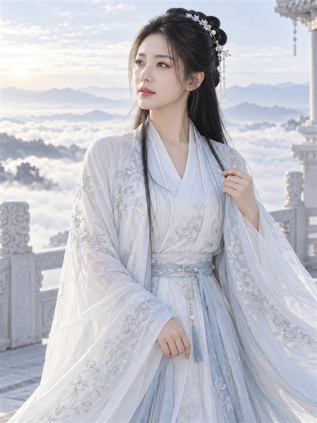 | 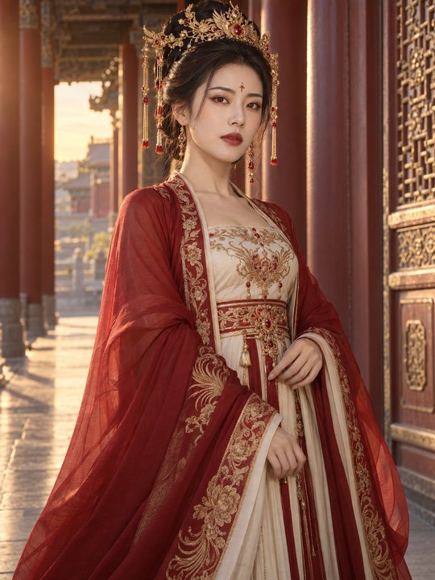 |

| 古风贵女美妆特写 |
|---|
| 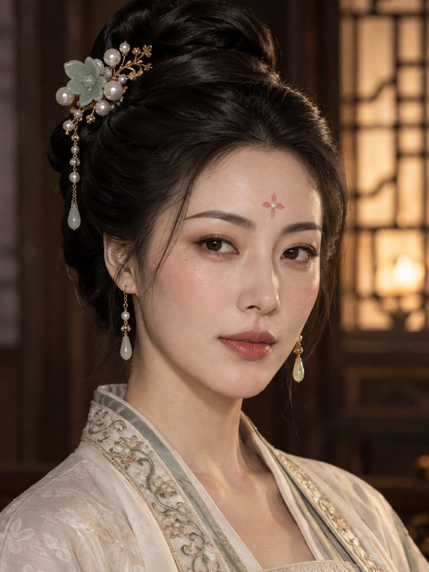 |

| 多参考图工作流 |
|---|
| 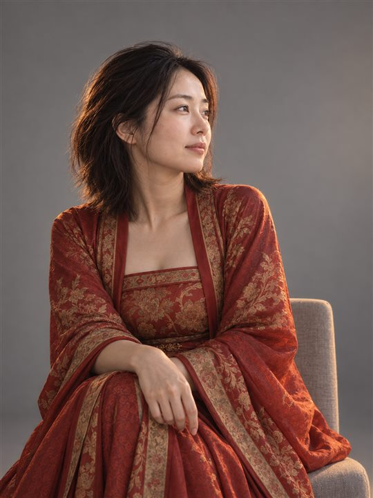 |

## 它能做什么

- 纯文字生成人像，例如：“生成一张雨夜上海街头的新中式成年女性电影写真。”
- 一句话直接完成导演，例如：“生成一个汉服美女。”系统会自动补齐成年人物、妆发、服装结构、动作、场景、镜头与面部光线。
- 每个内置风格从三个可拍场景中选择一个，并根据用户原话继续调整，而不是把固定模板原样复制到 Prompt。
- 需要时叠加一个气质方向：温柔自然、清冷克制、知性、明艳女主或轻熟都市；气质层不会偷换服装、场景和参考人物。
- 保持参考人物并改场景、发型、服装或光线。
- 让多张参考图分别负责人物、衣服、姿势、光线等部分。
- 把明确要求（如“外套必须红色”“不要首饰”）一直保留到最终提示词和出图调用。

## 支持的比例与尺寸

比例和像素尺寸是两个不同概念：比例控制构图形状，像素尺寸描述最终文件的宽和高。Skill 会锁定你明确写出的值，并检查两者是否一致；没有写像素时不会擅自补一个数字。

| 比例 | 方向 | 推荐用途 | 一致尺寸示例 |
|---|---|---|---|
| `1:1` | 方形 | 头像、社交资料、居中面部肖像 | `1080×1080`、`2048×2048` |
| `4:5` | 竖版 | 社交媒体人像、半身、编辑裁切 | `1080×1350` |
| `3:4` | 竖版 | 通用写真、汉服、半身到大腿构图 | `1080×1440`、`1536×2048` |
| `2:3` | 竖版 | 全身、服装展示、环境人像 | `1600×2400` |
| `9:16` | 长竖版 | 手机壁纸、Story / Reel 封面、竖版海报 | `1080×1920` |
| `4:3` | 横版 | 职业照、带环境叙事的人像 | `2048×1536` |
| `3:2` | 横版 | 摄影感环境人像 | `2400×1600` |
| `16:9` | 宽横版 | 电影场景、横幅、宽环境人像 | `1920×1080` |

- 没写比例的普通单人写真，默认使用 `3:4` 竖版；这是柔性默认值，明确比例永远优先。
- 只写“竖版 / 横版 / 方形”也可以：系统会选择兼容比例，不会把方向词误当成固定尺寸。
- 只写像素尺寸时，系统会按宽高推导唯一比例，例如 `1080×1350` → `4:5`。
- 比例正确不要求像素数字固定：`1086×1448` 与 `1536×2048` 都是严格 `3:4`。只有明确写出像素尺寸时，像素数字才构成交付要求。
- 同时写比例与尺寸时必须一致。`4:5 + 1080×1350` 可以直接执行；`4:5 + 1080×1440` 会先询问以哪个为准，不会拉伸或静默裁切。
- `2K / 4K / 高清` 没有唯一宽高；若精确交付依赖它，系统会询问具体像素，不会自行虚构。

一句话示例：

```text
生成一个汉服美女，竖版 3:4，1536×2048，真实摄影感，直接出图。
```

```text
生成一张成年女性建筑师职业肖像，横版 16:9，只要提示词。
```

> Codex 当前内置图片生成接口没有独立的 `size / width / height` 参数。Skill 会把比例和你明确填写的像素尺寸放在最终 Prompt 首句并保留到出图调用，但不能把“写入 Prompt”冒充为“接口原生锁定精确像素”。比例会作为受保护结果检查；精确像素只有在返回文件可检查时才能确认。

## 十五种内置风格

风格 Recipe 是柔性视觉方向，不会覆盖人物身份、指定颜色、“不要”规则或参考图角色。每个 Recipe 都带 3 个正向场景变体，总计 45 个；运行时只读取被选中的一个风格场景库，再选择其中一个案例，不会把 45 个案例同时塞进上下文。

| 风格 | 适合什么 | 主要视觉特征与边界 |
|---|---|---|
| 清纯 / 自然生活 `natural-lifestyle` | 咖啡馆、居家、街角、窗边日常 | 默认单人、人物与脸优先、背景无人、最多一个功能性道具；不做网红托腮摆拍或影楼目录感 |
| 新中式 / 现代东方 `modern-oriental` | 茶室、画廊、当代东方空间 | 现代剪裁、克制配色、留白；不变成古装、仙侠或符号堆叠 |
| 电影夜景 `cinematic-night` | 城市夜景、雨夜、夜间室内 | 单一主光逻辑、暗部层次；不把“电影感”简化成霓虹堆积 |
| 时装编辑 `editorial-fashion` | 时装大片、杂志、lookbook | 服装结构、图形化姿态、设计性构图；不变成电商目录或奢华道具堆 |
| 专业棚拍 `studio-portrait` | 灰/白/黑无缝背景、可控影棚 | 背景、主光、阴影与人物统一；不等于磨皮和廉价影楼摆姿 |
| 城市环境 `environmental-urban` | 建筑人像、都市写真、街头环境肖像 | 人与城市尺度、几何和空间关系；不把城市虚化成普通灯斑墙 |
| 模拟胶片 `analog-film` | 35mm、复古胶片、胶片编辑感 | 克制颗粒、色彩响应、柔和高光；不用随机漏光和划痕冒充胶片 |
| 暗调艺术 `fine-art-low-key` | 雕塑光、暗背景、克制艺术肖像 | 侧光塑形、负空间、暗部有结构；不自动添加烟雾、烛光或戏剧道具 |
| 高调极简 `high-key-minimal` | 纯白/暖白背景、明亮极简写真 | 柔光、低阴影密度、白色层次；不允许过曝吞掉皮肤和轮廓 |
| 职业肖像 `professional-portrait` | 商务头像、个人简介、创始人/职业品牌照 | 与职业和受众匹配的可信感；不默认西装、抱臂和素材库笑容 |
| 一句话古风女主 `gufeng-heroine` | 汉服美女、古风美女、古装美人、古风女主 | 面部与眼神优先、服装结构清楚、中高完成度；不做游客照或租赁古装照 |
| 历史向汉服 `historical-hanfu` | 宋制、明制、唐制、形制、考据、真实汉服 | 朝代与领型、衣袖、腰部、层次和妆发协调；不混搭朝代冒充复原 |
| 清冷仙侠 `cold-xianxia` | 清冷仙气、月白冰蓝、空灵疏离、冷调古偶 | 明亮冷白、低中反差、开放阴影、浅色云雾与轻纱分离；不让深蓝黑背景、蓝灰皮肤和特效吞掉人物 |
| 明艳华贵古风 `bright-luxury-gufeng` | 红金、盛唐、宫廷、重工头饰、华丽登场 | 红/象牙白/古金层级、女主光与材质高光；不做婚庆影楼或游戏 CG |
| 古风贵女美妆 `ancient-beauty-closeup` | 花钿、水光妆、贵女妆、古风面部特写 | 真实立体皮肤、明确眉眼、精确发饰与领口；不做瓷娃娃假面 |

### 一句话如何自动扩写

每个可执行请求都会经过同一套导演扩写门，不只处理短句。系统在内部补齐并保留五个视觉角色：人物、瞬间、服装、空间与镜头、光线与成片质感。扩写遵循以下边界：

- 一张图只保留一个主要时间切片、一个主要动作、一个视线目标和一个主光逻辑。
- 美女、古风、汉服和仙侠默认采用明亮通透的曝光结构：脸与主服装位于清晰中高明度，阴影打开，背景提供浅色分离；“清冷、电影感、克制”本身不会自动把画面压暗。
- 场景只选 2–3 个有效细节；公共空间不会为了“像咖啡馆/街头”自动添加其他人。
- 所有明确写出的衣服层次都要在画面中可见；手、道具、衣摆和视线必须能同时成立。
- 正向画面设计必须比负面词更具体；“高级、电影感、唯美”不会被当作完整导演方案。
- 出图失败时按额外人物、主体层级、动作、服装、道具、光线、风格、参考串域、比例、肢体接触或肤质身份分类，只允许一次定向修复。

五个可选气质层为：`gentle-natural`、`cold-composed`、`intellectual`、`bright-heroine`、`mature-urban`。未明确或不适合时不强行使用。

曝光另有三个互斥档位：`BRIGHT_AIRY`、`BALANCED_CLEAR`、`DARK_INTENTIONAL`。普通美女与古风默认使用明亮通透；只有用户明确要求夜景、低调、暗调，或参考图锁定暗色时才进入有意暗调。明亮不等于过曝，白衣、薄雾、肤色和珠玉仍必须保留纹理。

### 清纯 / 自然生活示例

```text
风格：清纯生活照
场景：午后咖啡馆靠窗座位
服装：米白针织开衫 + 浅色内搭
气质：温柔、自然、明确成年
画幅：3:4
直接出图。
```

该输入默认生成一名可见人物，咖啡馆背景不出现顾客、店员、路人、倒影人物或人物海报；两层服装必须都清楚保留，背景只用家具、窗光和最多一个功能性道具建立生活感。除非用户明确要求，不使用托腮、直视镜头标准微笑、举杯展示或前景书本堆叠。

### 新中式示例

```text
生成一张现代新中式成年女性写真，黑、米白、少量朱红配色，现代茶室场景，服装有现代东方轮廓，构图留白，气质克制高级，不要古装，不要仙侠，不要过度传统符号，竖版 3:4，直接出图。
```

### 电影夜景示例

```text
生成一张成年东方女性电影夜景写真，雨后城市街头，冷色环境光与暖色店铺侧光，主体清晰，真实肤质，背景有城市灯光层次，不要夸张霓虹特效，竖版 3:4，直接出图。
```

### 时装编辑示例

```text
生成一张成年东方女性时装编辑写真，黑色结构感长外套，浅灰无缝背景，低机位半身构图，人物侧身停住并直视镜头，服装轮廓优先，真实肤质，不要电商目录感，不要奢华道具堆，竖版 3:4，直接出图。
```

### 专业棚拍示例

```text
生成一张成年男性专业棚拍肖像，暖灰无缝背景，柔和大面积侧前方主光，肩部自然错开，眼神平静，背景与人物阴影方向一致，保留真实肤质，不要僵硬影楼摆姿，不要过度磨皮，竖版 4:5，直接出图。
```

### 城市环境示例

```text
生成一张成年东方女性城市环境人像，傍晚现代建筑连廊，人物刚走到转角停下，广角但不变形，保留建筑线条和城市纵深，人物与空间同等重要，不要霓虹泛滥，不要把背景完全虚化，竖版 3:4，直接出图。
```

### 模拟胶片示例

```text
生成一张成年女性 35mm 胶片感生活写真，午后公寓阳台，柔和高光、克制颗粒、自然肤色和轻微光学柔化，不要随机漏光、划痕、日期戳或橙色滤镜，竖版 3:4，直接出图。
```

### 暗调艺术示例

```text
生成一张成年女性暗调艺术肖像，深灰背景，一束大面积侧光塑造面部和肩颈，动作克制，留出大块负空间，暗部仍保留眼睛和服装细节，不要烟雾、烛光、宗教符号或恐怖感，竖版 4:5，直接出图。
```

### 高调极简示例

```text
生成一张成年东方女性高调极简写真，暖白背景和米白服装，宽柔光，人物自然站立，画面明亮但皮肤、头发边缘、衣服与背景层次清楚，不要证件照感，不要过曝，不要多余道具，竖版 3:4，直接出图。
```

### 职业肖像示例

```text
生成一张成年女性建筑师职业肖像，现代工作室环境，深灰针织上衣，半身构图，眼神自信但放松，背景保留少量建筑模型形成职业语境，不要默认西装，不要抱臂，不要素材库式笑容，横版 4:3，直接出图。
```

### 一句话古风女主示例

```text
生成一个汉服美女。
```

这类短句会直接出图：默认明确成年、3:4 竖版、面部与眼神优先，自动完成服装结构、妆发、动作链、场景层次和面部主光，不再要求用户先填写一整张参数表。

### 历史向汉服示例

```text
生成一张宋制汉服成年东方女性写真，真实摄影，不要仙侠，直接出图。
```

### 清冷仙侠示例

```text
生成一个月白冰蓝配色的清冷仙侠成年女主，直接出图。
```

该路线现在默认采用冷白明亮、低到中等反差、开放阴影和浅色云雾/建筑分离；不会再因为“清冷、仙侠、电影感”自动生成深蓝夜空、黑山墙或灰暗肤色。只有明确要求夜景或使用受保护的暗调参考图时才保留夜色，并仍保证脸、手和衣料可读。

### 明艳华贵古风示例

```text
生成一个红金盛唐宫廷成年美人，明艳华贵，直接出图。
```

### 古风贵女美妆示例

```text
生成一个带花钿和珠玉发饰的成年古风贵女水光妆特写，直接出图。
```

## 参考图用法

### 单张参考图

上传图片后直接说目标：

```text
保持这个人物，换成香港夜景，改成短发。
```

“保持人物”只锁定人物身份，不会自动锁死发型、衣服、背景或光线。

### 多张参考图

按上传顺序说清每张图负责什么：

```text
人物用图1，衣服用图2，姿势用图3，光线用图4，外套必须红色。
```

系统会保留四个独立角色，不把参考图压成一个模糊的“混合风格”。如果两张不同人物图都被要求作为最终人物，会先问你保留谁。

每张图的角色同时也是边界：姿势图只提供姿势，不应顺带带入它的人脸、衣服、杯子、桌子、背景或光线；服装图和光线图同理。

## 只要 Prompt 或直接出图

- 说“只要提示词，不要生成图片”：完整完成视觉设计与安全检查，只返回可复制 Prompt，不调用图片工具。
- 说“直接出图 / 生成图片 / 做一张写真”：完成同一流程后调用内置图片生成工具。
- 如果当前环境没有图片生成能力：返回 Prompt，并明确说明没有出图。

## 风格选择规则

只有明确出现受支持的风格线索时，系统才加载一个 Recipe；未指定风格时直接根据需求完成画面，不强套模板，也不会因为出现“高级、唯美、质感”等空泛形容词就误选风格。短句仍然可以触发完整导演：“汉服美女”进入通用古风女主；宋/明/唐制、清冷仙侠、红金盛唐和古风美妆特写会进入各自更具体的 Recipe。

当一句话里出现多个风格词时，系统仍只选择一个主 Recipe，并把其余词作为普通柔性要求。例如“新中式电影夜景”以新中式为主，夜景由场景与灯光处理；“35mm 自然生活”以胶片为主，自然生活作为动作与氛围要求。这样可以组合风格，又不会加载多个模板互相打架。

## 当前限制

- 当前版本面向成人肖像；未成年人性化内容会被阻止，年龄不明的敏感内容可能需要确认。
- 不提供跨会话人物一致性服务、批量变体导演或多模型切换。
- Codex 内置出图一次最多纳入五张最近的会话图片；目标图片不连续或已离开最近上下文时，可能需要重新上传。
- Codex 内置出图没有独立的精确像素参数；尺寸会进入 Prompt，但若你要求严格的最终像素交付，需要检查实际文件。生成后缩放或裁切属于单独导出操作，不会默认拉伸或切掉人物。
- 出图后会检查人物身份、明确动作/物体状态、硬要求、禁止项、比例、参考图串域、Recipe 保护条件与场景验收锚点；只在可观察结果失败时分类并定向重试一次，不因主观审美无限重试。
- “不要过度传统符号”这类程度限制会转成可见边界，而不是只把模糊原话塞进 Prompt；独立请求即使复用同一批参考图，也不会继承上一张的场景和限制。
- 真实人物参考不等于已获得授权；在敏感、欺骗性或商业高风险场景中可能需要确认。

## 安装

只允许安装到 Codex：

```bash
npx @kaiii-create/kai-skills install portrait-visual-director -t codex
```

指定其他平台会在写入文件前报错；`install all` 安装到其他平台时会自动跳过本 Skill。

## License

[MIT](../LICENSE)
